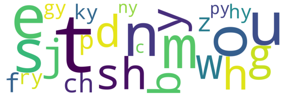
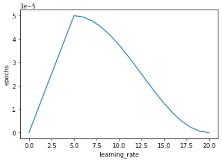

# HoloMora


## 1. Introduction
In this project, we tested the feasibility of a mora-based Japanese-to-English automatic speech recognition system as opposed to End-to-end English-centric solutions.

|Form|Cardinality|Text|
|-|-|-|
|Kanji|50,000+|やはり 向う 三 軒 りょう|
|Hiragana|46|やはり むこう さん けん りよう|
|Katakana|46|ヤハリ ムコウ サン ケン リョウ|
|Romaji|26|Yahari mukou sanken ryou|
|Proposed|33|y/a/h/a/r/i/m/u/k/o/u/s/a/n/k/e/n/ry/o/u|



### 1.1 Training Procedure
Due to memory constraints, these countermeasures had to be employed;
- Models were trained seperately and not end-to-end.
- Cosine decay with warm-up learning schedule was used for all models.
- Data was collated by sequence length to minimize padding within batches.
- Training loops were written in low-level Tensorflow to speed up computation and customizability.



|Model|Weights|Batch size|Epochs|Warm-up epochs|Learning rate|Training samples|Test split|Metrics|Training time|
|-|-|-|-|-|-|-|-|-|-|
|Acoustic|[wav2vec2-base](https://huggingface.co/facebook/wav2vec2-base)|4|20|5|5e-5|50,000|1:4|PER|70 hours|
|Decoder|[bert-base-japanese-char-v2](https://huggingface.co/cl-tohoku/bert-base-japanese-char-v2)|64|15|3|5e-5|500,000|1:4|CER|10 hours|
|Language|[opus-mt-ja-en](https://huggingface.co/Helsinki-NLP/opus-mt-ja-en)|xxx|xxx|xxx|5e-5|xxx|xxx|BLEU|xxx|

### 1.2 Performance results


### 2. Demo screens
PyQT5 and VLC MediaPlayer was utilized to built the user interface.


## 3. Setup
### 3.1 System Specification
All model trainings were performed locally.
```
AMD Ryzen 9 5950X
RTX 3060 12GB VRAM
4x8GB DDR4 2133MHz
Windows 10 Pro Build 21354
NVIDIA Driver 510.31
CUDA Toolkit 11.1
```

### 3.2 Environment
```
docker pull nvcr.io/nvidia/tensorrt:21.09-py3
```
#### requirements.txt
```
tensorflow
tensorflow-io
librosa
transformers
tokenizers
MeCab-python
cutlet
jiwer
sacrebleu
scikit-learn
numpy
pandas
soundfile
```
#### Dockerfile
```

```

## 4. References
### Papers
- [wav2vec 2.0: A Framework for Self-Supervised Learning of Speech Representations](https://arxiv.org/abs/2006.11477)
- [Exploring the Limits of Transfer Learning with a Unified Text-to-Text Transformer (T5)](https://arxiv.org/abs/1910.10683v3)
- [JSUT corpus: free large-scale Japanese speech corpus for end-to-end speech synthesis](https://arxiv.org/abs/1711.00354)
- [Common Voice: A Massively-Multilingual Speech Corpus](https://arxiv.org/abs/1912.06670)
- [Improving Massively Multilingual Neural Machine Translation and Zero-Shot Translation](https://arxiv.org/abs/2004.11867)

### Datasets
- [JSUT](https://sites.google.com/site/shinnosuketakamichi/publication/jsut)
- [Mozilla Common Voice](https://commonvoice.mozilla.org/en/datasets)
- [Kokoro-Librivox](https://github.com/kaiidams/Kokoro-Speech-Dataset)
- [OPUS-100](https://opus.nlpl.eu/opus-100.php)
- [Tatoeba](https://opus.nlpl.eu/Tatoeba.php)

### Misc.
- [ARPABET table](https://nlp.stanford.edu/courses/lsa352/arpabet.html)
- [Kanji unicode table](http://www.rikai.com/library/kanjitables/kanji_codes.unicode.shtml)
- [VB-Audio](https://vb-audio.com/Cable/)