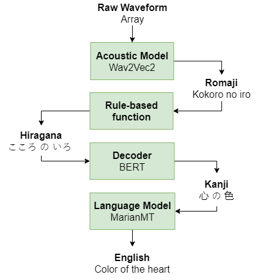

# HoloMora-ASR
Implementation of a speech-to-text model to Japanese YouTube streams for live-captioning.

## 1. Introduction
In this project, we tested the feasibility of a mora-based Japanese-to-English automatic speech recognition system as opposed to End-to-end English-centric solutions.

In recent years, multilingual models such as MBart, M2M100, MT5 and Wav2Vec2-XLSR have been released to tackle multilingual NLP tasks like machine translation. Albeit their success, these models tend to be computationally expensive as it learns multiple language embeddings. Unlike our case here, as we are only interested in Japanese to English transliterations, embeddings for other languages will not be important to us. As such, the baseline bilingual models of such architectures should be sufficient.

Contrastive to other ASR models such as DeepSpeech2 which takes in spectral features like MFCC, Wav2Vec2 directly takes in raw waveforms as input without any further preprocessing, and generates readable romanized sentences without the use of a language model. This is advantageous because of higher data preservation for model training but in turn is exponentially more costly to train.

### 1.1 Approach
|Form|Cardinality|Text|
|-|-|-|
|Original|50,000+|やはり 向う 三 軒 りょう|
|Hiragana|46|やはり むこう さん けん りよう|
|Katakana|46|ヤハリ ムコウ サン ケン リョウ|
|Romaji|26|Yahari mukou sanken ryou|



While there have been unofficial attempts in fine-tuning Wav2Vec2 models on Hiragana or Kanji data, there have not been publishings that document the success in developing Japanese ASR pipelines. Furthermore despite using deep architectures like Wav2Vec2-XLSR-large-53, the high dimensionality of character-based Japanese makes an End-to-End Japanese ASR model a suboptimal candidate. Therefore, a different approach has to be taken.

As Romaji text are made up of characters from the English language, by utilizing the pre-trained embeddings of these English alphabets we could possibly fine-tune Wav2Vec2's base model on romaji words. The resulting model will work as an acoustic model that transcribes raw waveforms into romaji text.

To transform the romaji text to the English language, another model will have to act as a language model that will transliterate the romaji text into English sentences.

### 1.2 Training Procedure
Both models were trained using Cosine Decay with warm up phase learning rate schedule. They were also trained seperately and not end-to-end due to the large size of the models.

|Model|Pretrained Weights|Batch Size|Accumulation Steps|Epochs|Samples|Learning rate|Metrics|Training time|
|-|-|-|-|-|-|-|-|-|
|Acoustic|wav2vec2-base|4|4|15|40,000|5e-5|PER, WER|75 hours
|Language|t5-base|16|2|10|1,200,000|5e-5|BLEU|100 hours

### 1.3 Performance results


### 1.3 Application Screens


## 2. Setup
### 2.1 System Specification
All model trainings were performed locally.
```
CPU: AMD Ryzen 9 5950X
GPU: RTX 3060 12GB VRAM
RAM: 32GB DDR4
OS: Windows 10 Pro Build 21354
```

### 2.2 Environment
```
docker pull nvcr.io/nvidia/tensorrt:21.09-py3
```
#### requirements.txt
```
tensorflow
tensorflow-io
librosa
transformers
tokenizers
MeCab-python
cutlet
jiwer
scikit-learn
numpy
pandas
soundfile
sentencepiece
```
#### Dockerfile
```

```

## 3. References
### Papers
- [wav2vec 2.0: A Framework for Self-Supervised Learning of Speech Representations](https://arxiv.org/abs/2006.11477)
- [Exploring the Limits of Transfer Learning with a Unified Text-to-Text Transformer (T5)](https://arxiv.org/abs/1910.10683v3)
- [JSUT corpus: free large-scale Japanese speech corpus for end-to-end speech synthesis](https://arxiv.org/abs/1711.00354)
- [Common Voice: A Massively-Multilingual Speech Corpus](https://arxiv.org/abs/1912.06670)
- [Improving Massively Multilingual Neural Machine Translation and Zero-Shot Translation](https://arxiv.org/abs/2004.11867)

### Model Weights
- [Wav2Vec2-base](https://huggingface.co/facebook/wav2vec2-base)
- [T5-base](https://huggingface.co/t5-base)

### Datasets
- [JSUT](https://sites.google.com/site/shinnosuketakamichi/publication/jsut)
- [Mozilla Common Voice](https://commonvoice.mozilla.org/en/datasets)
- [Kokoro-Librivox](https://github.com/kaiidams/Kokoro-Speech-Dataset)
- [OPUS-100](https://opus.nlpl.eu/opus-100.php)
- [Tatoeba](https://opus.nlpl.eu/Tatoeba.php)

### Misc.
- [ARPABET table](https://nlp.stanford.edu/courses/lsa352/arpabet.html)
- [Kanji unicode table](http://www.rikai.com/library/kanjitables/kanji_codes.unicode.shtml)